# OptiTrade Pro

[](https://github.com/Jatin-IITB/opti-trade-pro/actions/workflows/ci.yml)


**A production-grade autonomous volatility desk** — from option pricing through
risk-controlled paper trading to an LLM-augmented research loop — built as two
strictly layered packages with 23 architecture decision records, a fail-closed
risk engine, and 571 deterministic tests enforcing every quantitative claim.

> Every number in this README names the test that checks it (CLAUDE.md rule 8).

## Architecture

```mermaid
graph TB
    subgraph Platform["options_trading — FastAPI + Upstox"]
        API["Analytics API<br/><small>surface · greeks · scenarios · risk</small>"]
        CAP["Live Capture<br/><small>Upstox → quote filters → Parquet</small>"]
        SCHED["Capture Scheduler<br/><small>IST market window</small>"]
        DASH["Dashboards &amp; Auth"]
    end

    subgraph Core["optitrade — pure quant core (numpy/scipy, no I/O)"]
        VOL["Vol Surface<br/><small>spline · SABR · eSSVI joint</small>"]
        GRK["Greeks Engine<br/><small>analytic · FD · adjoint AD · JAX AD</small>"]
        HDG["Hedging<br/><small>Whalley-Wilmott · gamma scalp</small>"]
        RSK["Risk Engine<br/><small>fail-closed, 4 checks</small>"]
        GOV["Governance<br/><small>debate panel · veto rule</small>"]
        DESK["Paper Desk<br/><small>daily cycle · kill switch</small>"]
        BT["Walk-Forward<br/><small>deflated Sharpe · VRP strategy</small>"]
        AGT["Agent Layer<br/><small>LLM analysts · orchestrator</small>"]
        RES["Research Loop<br/><small>propose → evaluate → rank</small>"]
        JRN["Event Journal<br/><small>append-only JSONL</small>"]
        MCP["MCP Server<br/><small>6 journaling tools</small>"]
        EXP["P&amp;L Explain<br/><small>PCA factors · attribution</small>"]
        AUD["Groundedness Audit<br/><small>claim ↔ journal verification</small>"]
    end

    Platform -->|"imports (never reverse)"| Core
    API --> VOL & GRK & HDG & RSK
    CAP --> VOL
    DESK --> GOV --> RSK
    DESK --> HDG
    DESK --> BT
    AGT --> AUD --> JRN
    RES --> BT
    MCP --> JRN
    EXP --> JRN
```



**One-way dependency** (ADR-002): the platform imports the core — never the reverse.
The quant core has zero web framework, broker SDK, or network dependencies.

## Design highlights

These are the engineering decisions that make this project non-trivial:

| Decision | Why it matters | Evidence |
|---|---|---|
| **Fail-closed risk engine** | Any exception inside a risk check converts to REJECT — never a pass-through. Property-tested: no limit-breaching order is ever approved. | `test_risk.py` · ADR-008 |
| **Four independent Greeks methods** | Analytic BS, finite-diff, from-scratch tape-based adjoint AD, and JAX automatic differentiation all agree pairwise across a full parameter sweep — catches model bugs that one method alone would miss. JAX adds exact higher-order Greeks (charm, speed, color, ultima) via nested `jax.grad`. | `test_greeks_cross.py` · ADR-006 · ADR-023 |
| **Deflated Sharpe ratio** | Walk-forward reports OOS Sharpe **and** the Bailey–López de Prado deflated Sharpe with honest trial accounting — prevents overfitting from selection bias. | `test_dsr.py` · ADR-016 |
| **Groundedness auditing** | Agent claims are trusted only if every number matches the journal event it cites. LLM analysts produce deterministic claims + LLM narrative — the LLM never touches the claim pipeline. | `test_groundedness.py` · ADR-021 |
| **Event-sourced decisions** | Every hedge, risk verdict, and debate outcome is appended to an append-only JSONL journal with monotonic sequences and correlation IDs. A full run replays as evidence. | `test_journal.py` · ADR-009 |
| **Governance debate panel** | Trade proposals go through a deterministic expert panel with confidence-weighted consensus and a confident-veto rule (confidence >= 0.9 blocks regardless of score). | `test_governance.py` · ADR-010 |
| **Research loop with human gate** | Agents propose parameter changes, walk-forward evaluates, results are journaled — but proposals are never auto-applied. Human approval gate prevents automated strategy drift. | `test_research_loop.py` · ADR-022 |
| **Backtested code = production code** | The `Strategy` protocol is shared by walk-forward and live desk — the code that runs in backtest *is* the code that runs in paper trading. No divergence by construction. | `test_daily_cycle.py` · ADR-018 |

## The four engines

| Engine | What it does | Verified by |
|---|---|---|
| **Vol surface** | IV stripping → cubic-spline smiles → per-expiry SABR (Hagan 2002) → calendar interpolation; eSSVI joint calibration (Gatheral–Jacquier 2014) with butterfly penalties and Durrleman g(k) >= 0; risk-neutral density gate | SABR RMSE **< 0.3 vol-pt** (`test_sabr.py`); eSSVI RMSE **0.076 vol-pt**, **0 Durrleman violations** (`test_essvi.py`); density gate (`test_density.py`) |
| **Greeks** | Four methods: vectorised analytic BS, central finite differences, from-scratch tape-based adjoint AD, and JAX AD with exact higher-order Greeks (charm/speed/color/ultima) via nested `jax.grad`; `jax.vmap` book-level vectorisation; broadcast scenario grids | Methods agree pairwise (`test_greeks_cross.py`, `test_jax_ad.py`); **539 cells x 50 positions < 200 ms** (`test_scenario.py`) |
| **Hedging** | Whalley–Wilmott (1997) no-transaction band; gamma scalping with EWMA RV/IV modulation; Taylor P&L attribution | GBM sim: hedged P&L tracks theta; long-gamma earns when RV > IV (`test_hedging_sim.py`) |
| **Risk** | Fail-closed pre-trade: Greeks caps, margin sufficiency, drawdown halt, concentration resize; verdict precedence HALT > REJECT > RESIZE > APPROVE | **No limit-breaching order ever approved** — property tested (`test_risk.py`) |

## Flagship layers

Built on the [autonomous-volatility-desk roadmap](docs/roadmap.md):

| Layer | Package | What it does | Tests |
|---|---|---|---|
| Data spine | `optitrade.data` | NSE-reality quote filters (crossed books, stale quotes, wide spreads) + Parquet snapshot store | `test_quote_filters.py`, `test_snapshot_store.py` |
| P&L explain | `optitrade.explain` | Daily decomposition: theta, gamma-vs-RV, vega per PCA factor, vanna/volga, residual | `test_pnl_explain.py`, `test_factors.py` |
| VRP strategy | `optitrade.strategy` | Variance risk premium harvesting with Indian cost model (STT/exchange/GST/SEBI/stamp/brokerage) | `test_vrp_strategy.py`, `test_costs.py` |
| Walk-forward | `optitrade.backtest` | Combinatorial purged cross-validation, deflated Sharpe, synthetic + real-history replay | `test_walk_forward.py`, `test_dsr.py` |
| Paper desk | `optitrade.desk` | Daily cycle: mark → strategy → debate → risk → fill → hedge → journal; kill switch on drawdown halt | `test_daily_cycle.py`, `test_kill_switch.py` |
| Live capture | `options_trading` | Upstox chains → quote filters → Parquet; unattended scheduler inside IST window | `test_capture_service.py`, `test_capture_scheduler.py` |
| Desk platform | `options_trading` | Drives the core cycle over captured history: one cycle per stored day, idempotent by recorded date, book persisted across restarts, journal decision trail, file-based kill switch. **Paper fills only — the app has no order-placement path** | `test_desk_service.py`, `test_desk_routes.py`, `test_desk_state_store.py` |
| Drift metric | `optitrade.desk` | Backtest-vs-desk reconciliation on identical days — measures the execution-model gap in bps | `test_reconcile.py` |
| Daily report | `optitrade.desk` | Markdown artifact: desk summary + analyst sections, each groundedness-scored | `test_daily_report.py` |
| LLM analysts | `optitrade.agents` | Hybrid: deterministic claims + LLM narrative; orchestrator runs both tiers, fail-open capture | `test_llm_analyst.py`, `test_orchestrator.py` |
| Research loop | `optitrade.research` | GridSearch + LLM agents propose → walk-forward evaluates → rank → journal; human approval gate | `test_research_loop.py`, `test_research_evaluator.py` |
| MCP server | `optitrade.mcp_server` | 6 journaling tools: `price_option`, `book_greeks`, `run_scenarios`, `review_order`, `journal_tail`, `run_experiment` | `test_mcp_server.py` |
| Groundedness | `optitrade.audit` | Deterministic auditor: claim numbers must match journal citations | `test_groundedness.py` |

## Quick start

```bash
uv venv --python 3.12 && uv pip install -e ".[dev]"   # or: pip install -e ".[dev]"

optitrade demo         # end-to-end: chain → surface → Greeks → debate → risk → hedging sim
optitrade cycle        # paper desk: strategy → debate → risk → fills → hedge → kill switch
optitrade research     # research loop: grid-search → walk-forward → ranked proposals

pytest -q              # 571 tests, deterministic (seeded RNGs, no network)
pytest -q -m benchmark # latency targets (run locally)
```

Run the platform (needs Upstox credentials in `.env`, see `.env.example`):

```bash
uvicorn options_trading.main:app --reload --port 8000
# docs at http://localhost:8000/docs — quant endpoints under /api/v1/analytics/*
```

## Analytics API

| Endpoint | Input | Output |
|---|---|---|
| `POST /api/v1/analytics/surface` | Option chain | Spline + SABR surface, fit RMSE, arb violations |
| `POST /api/v1/analytics/greeks` | Book positions | Aggregate + per-position Greeks |
| `POST /api/v1/analytics/scenarios` | Book + grid params | DS x Dvol x Dt P&L cube, worst/best cells |
| `POST /api/v1/analytics/hedge/decide` | Position + market | Whalley–Wilmott band decision with rationale |
| `POST /api/v1/analytics/risk/review` | Order + context | Fail-closed verdict with per-check reasons |

## How decisions are made

The same debate → consensus → recorded-decision mechanism runs at two timescales:

- **Runtime**: `DebatePanel` + `RiskEngine` journal every trade decision with reasons and
  correlation IDs (ADR-008, ADR-009, ADR-010).
- **Engineering**: contested design choices get a debate record in `docs/debates/` and land
  as a numbered ADR in `docs/adr/` (ADR-001; process in `docs/governance.md`).

Start with [docs/architecture.md](docs/architecture.md), then the ADR index in
[docs/adr/](docs/adr/). Engineering standards: [CLAUDE.md](CLAUDE.md).

## Project structure

```
src/optitrade/            quant core (numpy/scipy, mypy-strict, no web/broker deps)
  core/ pricing/ vol/ greeks/ hedging/ risk/ journal/ governance/
  attribution/ backtest/ data/ explain/ audit/ strategy/ desk/
  agents/ research/ mcp_server.py
src/options_trading/      FastAPI platform: auth, market data, dashboards, analytics routes
tests/unit/quant/         the enforcing tests referenced throughout this README
docs/adr/                 architecture decision records (ADR-001...023)
docs/debates/             expert-debate records behind the contested ADRs
```

## Conventions

Year-fraction time (ACT/365), continuously compounded rates, decimal vols, vega per unit
vol, theta per year, signed quantities (ADR-003). Toolchain: ruff + tiered mypy + pytest
with deterministic seeds (ADR-004). Conventional Commits; branch from `main`.

## License & disclaimer

MIT. This software is for research and education. Options trading involves substantial
risk; nothing here is investment advice.
