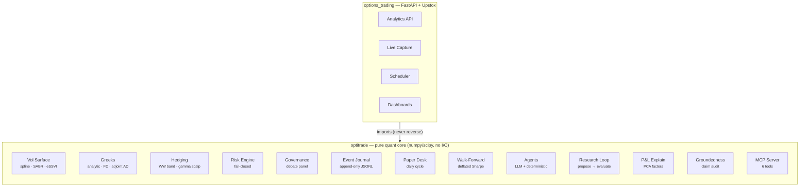
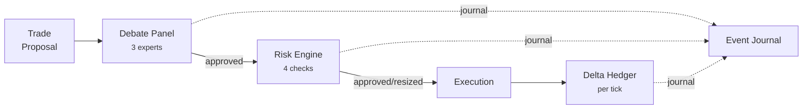

# Architecture

Two packages, one-way dependency (ADR-002):

## Decision flow for a trade

Every arrow into the journal carries a correlation ID, so one order's debate → risk review →
hedge chain replays as a unit (`EventLog.events_by_correlation`).

## Engines and their enforcing tests

| Engine | Headline behaviour | Enforced by |
|---|---|---|
| Vol surface | SABR round-trip RMSE < 0.3 vol-pt | `test_sabr.py` |
| Vol surface v2 | eSSVI joint fit, 0 Durrleman violations, RMSE 0.076 vol-pt | `test_essvi.py` |
| Vol surface v2 | Risk-neutral density gate (pdf >= 0, integral ~= 1, mean ~= F) | `test_density.py` |
| Greeks | analytic = finite-diff = adjoint AD | `test_greeks_cross.py` |
| Greeks | 539-cell grid, 50 positions, < 200 ms | `test_scenario.py` |
| Hedging | Hedged P&L tracks theoretical theta in GBM sim | `test_hedging_sim.py` |
| Risk | 100% of out-of-bound orders blocked (property test) | `test_risk.py` |
| Journal | Replay + sequence recovery | `test_journal.py` |
| Governance | Confident-veto consensus | `test_governance.py` |
| Data spine | Filter semantics + lossless Parquet round-trip | `test_quote_filters.py`, `test_snapshot_store.py` |
| P&L explain | Exact Taylor reconciliation; factor vega additivity | `test_pnl_explain.py`, `test_factors.py` |
| Audit | Fabricated numeric claims rejected with named reasons | `test_groundedness.py` |
| MCP | Tools journal every call; optional-dep import hygiene | `test_mcp_server.py` |
| Walk-forward | Deflated Sharpe with honest trial accounting | `test_dsr.py`, `test_walk_forward.py` |
| Paper desk | Full daily cycle: mark → strategy → debate → risk → fill → hedge | `test_daily_cycle.py` |
| Drift | Backtest-vs-desk reconciliation on identical days | `test_reconcile.py` |
| LLM analysts | Hybrid: deterministic claims + LLM narrative, 100% grounded | `test_llm_analyst.py` |
| Research loop | Propose → evaluate → rank → journal; human approval gate | `test_research_loop.py` |

## Layering rules

- `optitrade` never imports `options_trading`, FastAPI, or broker SDKs.
- The platform maps broker/market payloads into `optitrade.core` types at the boundary
  (`MarketSnapshot`, `BookPosition`) and maps results back out.
- All tunables are typed config dataclasses; no magic numbers inside flows (CLAUDE.md rule 2).
